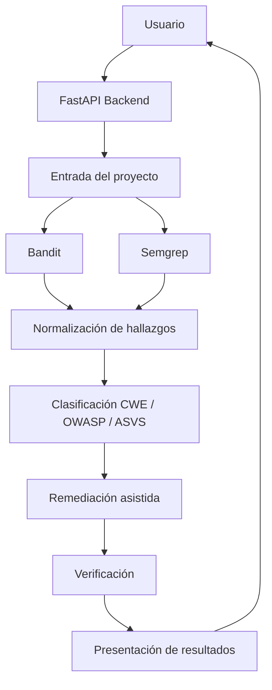

# Arquitectura del sistema (MVP y ampliaciones)

## 1. Propósito de la arquitectura

En este TFG planteo una arquitectura inicial orientada a construir una aplicación web para el análisis y la remediación asistida de vulnerabilidades de seguridad en proyectos Python, especialmente aplicaciones web. La arquitectura propuesta busca ser realista, modular y viable dentro del alcance de un Trabajo Fin de Grado, evitando complejidad innecesaria y priorizando un diseño defendible académicamente.

El objetivo no es construir una plataforma generalista de análisis de seguridad ni un sistema totalmente autónomo de corrección de código, sino una solución acotada que permita recorrer de forma controlada el flujo principal del proyecto:

1. detección de vulnerabilidades,
2. propuesta de remediación,
3. verificación posterior,
4. presentación del resultado al usuario.

Esta arquitectura se ha definido para dar soporte al enfoque **detect–repair–verify**, manteniendo siempre supervisión humana en la fase final de aceptación de cambios.

## 2. Principios de diseño

Para orientar el diseño inicial del sistema he seguido los siguientes principios:

- **alcance acotado**: el sistema se centra únicamente en proyectos Python y no intenta resolver análisis multilenguaje;
- **modularidad**: cada fase principal del flujo se separa en componentes con responsabilidades claras;
- **trazabilidad**: los resultados del análisis, la propuesta de remediación y la verificación deben poder documentarse y relacionarse entre sí;
- **verificabilidad**: no se considera suficiente detectar o proponer cambios; es necesario comprobar posteriormente el resultado;
- **supervisión humana**: la aplicación no debe aplicar cambios ciegamente como criterio principal del MVP;
- **viabilidad académica**: la arquitectura debe poder implementarse por un estudiante en el contexto temporal y técnico de un TFG.

## 3. Visión general del sistema

La solución se plantea como una aplicación web con backend en **FastAPI**. Este backend actúa como punto central de coordinación del flujo de análisis, integrando herramientas de análisis estático, lógica de clasificación, propuestas de remediación y verificación posterior.

De forma simplificada, el flujo será el siguiente:

1. el usuario proporciona un proyecto Python a analizar;
2. el backend prepara el entorno de análisis;
3. se ejecutan herramientas de detección como **Bandit** y **Semgrep**;
4. los hallazgos se normalizan en una estructura común;
5. los resultados se relacionan con estándares reconocidos como CWE, OWASP Top 10 y OWASP ASVS;
6. para ciertos casos del MVP, el sistema genera propuestas de remediación;
7. la remediación propuesta se verifica mediante reanálisis y, cuando proceda, mediante pruebas;
8. finalmente, el sistema presenta al usuario el resultado del proceso.

## 4. Componentes principales

### 4.1. API backend

El núcleo de la aplicación es un backend desarrollado con **FastAPI**. He elegido esta tecnología por su sencillez, buena integración con Python, facilidad para construir APIs y adecuación al alcance del proyecto.

Este componente será responsable de:

- exponer los endpoints necesarios;
- recibir peticiones de análisis;
- coordinar el flujo interno del sistema;
- devolver resultados estructurados al usuario.
- renderizar una consola web ligera (`/dashboard`) sobre la misma lógica presentable de la API.

### 4.2. Módulo de entrada del proyecto

Este módulo se encarga de gestionar el proyecto Python que se desea analizar. En el MVP se parte de ejemplos controlados (`fixtures/mvp`), y en la ampliación ya implementada se incorporan tres entradas para proyectos reales con controles de seguridad: ZIP (`POST /analysis/upload-zip`), ruta local bajo raíz permitida (`POST /analysis/local-path`) y clonado Git HTTPS acotado (`POST /analysis/git-clone`).

Sus funciones principales serán:

- recibir la ruta o contenido a analizar;
- preparar el proyecto para su inspección;
- garantizar que el análisis se ejecuta sobre el material esperado.

La interfaz web (`/dashboard`) cubre `fixture_reports`, `fixture_runtime`, `upload_zip` y `local_path` (si hay raíz local configurada). El flujo de `git-clone` y el pipeline completo de verificación MVP se mantienen como endpoints API en esta iteración.

### 4.3. Módulo de análisis estático

Este componente ejecutará las herramientas base de detección:

- **Bandit**, orientado a análisis de seguridad sobre código Python;
- **Semgrep**, utilizado como apoyo mediante reglas configurables y detección complementaria.

La razón de utilizar ambas herramientas es que permiten partir de una base reconocida, reproducible y técnicamente justificable, en lugar de delegar toda la detección a un modelo de IA.

### 4.4. Normalizador de hallazgos

Dado que Bandit y Semgrep generan resultados con formatos distintos, será necesario un componente intermedio que transforme esos hallazgos en una estructura común.

Esta normalización permitirá trabajar de forma homogénea con atributos como:

- herramienta de origen,
- regla o identificador,
- fichero afectado,
- línea o localización,
- severidad,
- descripción,
- posible relación con CWE u OWASP,
- posibilidad o no de remediación automática.

Este componente es importante porque hace posible que el sistema no dependa de la forma particular en la que cada herramienta devuelve sus resultados.

### 4.5. Módulo de clasificación

Una vez normalizados los hallazgos, el sistema incorporará una fase de clasificación. En ella se intentará relacionar cada resultado con estándares y referencias reconocidas, especialmente:

- **CWE**,
- **OWASP Top 10**,
- **OWASP ASVS**.

Esta fase aporta valor académico y técnico, porque no se limita a mostrar una alerta aislada, sino que la contextualiza dentro de marcos reconocidos en ciberseguridad.

### 4.6. Módulo de remediación asistida

Este módulo será responsable de generar propuestas de remediación cuando el tipo de vulnerabilidad y el contexto permitan hacerlo con un nivel razonable de fiabilidad.

En el MVP, la remediación estará restringida a casos concretos y acotados, por ejemplo:

- uso inseguro de `yaml.load`,
- `verify=False`,
- ausencia de `timeout`,
- `debug=True` en Flask,
- algunos casos sencillos relacionados con `shell=True` o `os.system`.

No todos los hallazgos tendrán el mismo tratamiento. Por ejemplo, en el caso de **SQL injection**, el objetivo inicial será solo detectar y proponer una orientación general de remediación, pero no aplicar automáticamente un parche.

### 4.7. Módulo de verificación

La verificación es una de las partes centrales del proyecto y uno de los elementos que justifican el enfoque detect–repair–verify.

Después de generar una propuesta de remediación, el sistema deberá comprobar el resultado. Esta verificación puede incluir:

- reejecución de Bandit y Semgrep;
- validación básica de que el hallazgo desaparece o mejora;
- ejecución de pruebas con **pytest** cuando tenga sentido.

La verificación no garantiza que el código sea perfecto o completamente seguro, pero sí aporta una capa adicional de control frente a una simple generación de cambios no comprobados.

### 4.8. Módulo de presentación de resultados

Finalmente, el sistema debe devolver al usuario una salida comprensible. Esta salida debería reflejar:

- qué vulnerabilidades se han encontrado;
- cómo se clasifican;
- qué propuesta de remediación se ha generado, si procede;
- qué resultado ha tenido la verificación;
- qué decisiones requieren revisión humana.

En el MVP, la prioridad será que esta salida sea clara y útil, más que diseñar una interfaz sofisticada.

## 5. Flujo principal del sistema

El flujo general implementado puede resumirse así:

1. el usuario selecciona o proporciona un proyecto Python;
2. el backend inicia el análisis;
3. Bandit y Semgrep procesan el código;
4. los resultados se transforman a un formato normalizado;
5. cada hallazgo se clasifica y contextualiza;
6. si el caso está dentro del alcance del MVP, se genera una propuesta de remediación;
7. la propuesta se verifica mediante reanálisis y, cuando proceda, con pruebas;
8. se genera una respuesta final para el usuario;
9. el usuario decide si acepta o no la remediación propuesta.

## 6. Diagrama de componentes

A nivel conceptual, la arquitectura inicial puede representarse así:

## 7. Herramientas de soporte al desarrollo

Además de los componentes funcionales, el proyecto se apoya en varias herramientas que forman parte de su arquitectura de desarrollo:

- pytest, para pruebas y validación;
- pre-commit, para controles básicos de calidad local;
- GitHub Actions, para integración continua;
- GitHub Projects, issues y pull requests, para planificación y trazabilidad;
- WSL y VS Code, como entorno de desarrollo local.

Estas herramientas no forman parte directa del producto final de usuario, pero sí son importantes para garantizar calidad interna, proceso ordenado y evidencia de desarrollo.

## 8. Limitaciones iniciales de la arquitectura

He decidido dejar explícitas varias limitaciones para mantener el proyecto dentro de un alcance viable:

- no se abordará soporte multilenguaje (en principio).
- no se implementará en el MVP un sistema de parcheo automático generalista.
- no se pretende cubrir todo el espectro de vulnerabilidades web.
- no se incluirá inicialmente análisis dinámico completo;
- no se automatizará la integración completa con pull requests de GitHub.
- la remediación automática se limitará a casos concretos, simples y verificables.

Estas restricciones no deben entenderse como carencias del diseño, sino como decisiones deliberadas de acotación para que el TFG sea realizable y defendible.

## 9. Justificación de la arquitectura elegida

Considero que esta arquitectura es adecuada para el TFG por varios motivos.

En primer lugar, parte de tecnologías y herramientas consolidadas en el ecosistema Python, lo que reduce el riesgo técnico. En segundo lugar, separa claramente análisis, clasificación, remediación y verificación, lo que facilita tanto la implementación como la explicación académica del sistema. En tercer lugar, permite demostrar una aportación propia sin caer en una ambición excesiva: el valor del proyecto no está en “crear un escáner universal”, sino en combinar herramientas reconocidas con un flujo asistido y verificable de remediación.

Por tanto, esta arquitectura inicial servirá como base del desarrollo posterior, sabiendo que algunos detalles podrán refinarse durante la implementación, pero manteniendo estable la estructura general del sistema.
